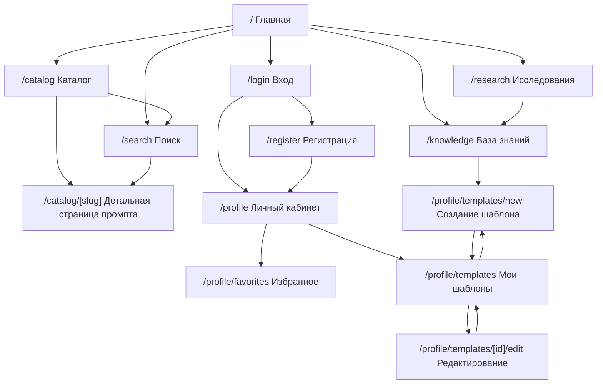

# PromptHub

PromptHub — сервис для работы с промптами, шаблонами и материалами по промпт-инжинирингу.

## Функции сервиса

- редактор промптов;
- база знаний по форматированию промптов;
- база исследований;
- готовые шаблоны по форматированию промптов;
- личный кабинет;
- создание своих шаблонов;
- возможность делиться шаблонами публично;
- публичный каталог промптов с поиском и фильтрацией;
- добавление промптов в избранное.

## Технологический стек

- Next.js;
- React;
- TypeScript;
- CSS Modules;
- React Hook Form;
- Zod;
- Jest;
- React Testing Library;
- Playwright.

## Запуск проекта

```bash
npm install
npm run dev
```

Проект будет доступен по адресу:

```txt
http://localhost:3000
```

## Скрипты

В `package.json` должны быть добавлены скрипты:

```json
{
  "scripts": {
    "dev": "next dev",
    "build": "next build",
    "start": "next start",
    "lint": "next lint",
    "test": "jest",
    "test:watch": "jest --watch",
    "test:coverage": "jest --coverage",
    "test:e2e": "playwright test",
    "test:e2e:ui": "playwright test --ui"
  }
}
```

## Информационная архитектура

### `/`

Главная страница. Показывает назначение сервиса и ведёт пользователя к основным сценариям: каталог, поиск, база знаний и создание шаблона.

### `/catalog`

Каталог шаблонов. Пользователь видит карточки промптов и может фильтровать их по категориям.

### `/catalog/[slug]`

Детальная страница промпта. Содержит описание, теги, переменные, текст промпта и кнопку копирования.

### `/search`

Страница поиска по шаблонам. Поддерживает поисковую строку, категории, подсказки, загрузку, пустое состояние и ошибку.

### `/knowledge`

База знаний по структуре промптов, переменным и форматированию.

### `/research`

База исследований и практических материалов о работе с языковыми моделями.

### `/login`

Страница входа в аккаунт. После входа пользователь получает доступ к личному кабинету.

### `/register`

Страница регистрации. После регистрации пользователь попадает в личный кабинет.

### `/profile`

Обзор личного кабинета. Доступен только после входа.

### `/profile/favorites`

Избранные промпты пользователя. Доступны только после входа.

### `/profile/templates`

Список созданных пользователем шаблонов. Доступен только после входа.

### `/profile/templates/new`

Создание нового шаблона промпта. Доступно только после входа.

### `/profile/templates/[id]/edit`

Редактирование созданного шаблона. Доступно только после входа.

## Карта навигации



## Навигация

### Header

Статическая навигация, одинаковая на всех страницах. Содержит переходы в каталог, базу знаний, исследования, поиск, вход и создание шаблона.

### Footer

Статическая навигация в нижней части сайта.

### Breadcrumbs

Контекстная навигация. Хлебные крошки строятся по текущему маршруту и выводятся на русском языке.

### ProfileSidebar

Контекстная навигация внутри личного кабинета: обзор, избранное, мои шаблоны, создание шаблона.

## Формы и валидация

В проекте есть формы:

- вход;
- регистрация;
- создание шаблона;
- редактирование шаблона;
- поиск.

Валидация реализована через React Hook Form и Zod. Кнопки отправки блокируются, пока данные невалидны. Ошибки выводятся рядом с полями.

## Поиск

Страница `/search` поддерживает:

- отправку параметров через query string;
- задержку перед запросом;
- подсказки;
- фильтрацию по категории;
- восстановление состояния из URL;
- состояние загрузки;
- состояние ошибки;
- пустое состояние;
- отмену запроса через AbortController.

## Редактор промптов

Компонент `PromptEditor` используется в форме создания и редактирования шаблонов.

Редактор поддерживает быстрые вставки:

- заголовок `## Heading`;
- переменную `{{variable}}`;
- XML-тег `<context></context>`;
- разделитель `—`;
- стрелку потока `→`;
- декоратор `+++Format`.

## Авторизация и личный кабинет

Личный кабинет закрыт клиентским guard-компонентом `AuthGuard`.

Если пользователь открывает `/profile/templates/new` без входа, он перенаправляется на `/login`. После входа или регистрации пользователь возвращается к нужному разделу.

Созданные шаблоны сохраняются отдельно для каждого пользователя.

## Тестирование

### Unit-тесты

Добавлены тесты для:

- схем входа и регистрации;
- схемы создания шаблона;
- поиска и фильтрации промптов;
- разбора синтаксиса промпта;
- карточки промпта.

Запуск:

```bash
npm run test
```

Проверка покрытия:

```bash
npm run test:coverage
```

### Интеграционный тест

Добавлен тест компонента `PromptEditor`: проверяется, что кнопки редактора меняют содержимое textarea.

### E2E-тест

Добавлен сценарий Playwright:

```txt
регистрация → личный кабинет → создание шаблона → сохранение → отображение в списке шаблонов
```

Запуск:

```bash
npm run test:e2e
```

## Соответствие домашним заданиям

| Этап | Что реализовано | Где смотреть |
|---|---|---|
| ДЗ 1 | Информационная архитектура, страницы, навигация, breadcrumbs, sitemap, robots | `README.md`, `src/app`, `src/widgets` |
| ДЗ 2 | Формы, валидация, поиск, подсказки, URL-параметры, mock API | `src/features/auth-form`, `src/features/template-form`, `src/features/prompt-search`, `src/app/api` |
| ДЗ 3 | Unit, integration и E2E-тесты, редактор промптов, guard личного кабинета | `src/**/*.test.tsx`, `src/**/*.test.ts`, `tests/e2e`, `src/features/prompt-editor`, `src/features/auth-form/ui/AuthGuard.tsx` |
| ДЗ 4 | Динамические импорты, мемоизация, оптимизация списков, подготовка к Lighthouse-аудиту | `src/app/catalog/page.tsx`, `src/app/profile/templates/new/page.tsx`, `src/features/prompt-catalog`, `src/entities/prompt`, `docs/lighthouse` |

## Производительность

В проект добавлены базовые оптимизации клиентской части:

- тяжёлые клиентские разделы подключаются через `next/dynamic`;
- каталог, поиск, список шаблонов, создание и редактирование шаблона вынесены в отдельные чанки;
- редактор промптов загружается отдельно от основной формы;
- карточка промпта обёрнута в `React.memo`;
- редактор промптов обёрнут в `React.memo`;
- вычисление валидности формы выполняется через `useMemo`;
- обработчики формы и фильтров стабилизированы через `useCallback`;
- списки карточек мемоизированы через `useMemo`;
- для длинных списков добавлен `content-visibility`;
- CSS разделён по CSS Modules, глобальные стили оставлены минимальными;
- добавлены loading-состояния для динамически загружаемых страниц.

## Lighthouse-аудит

Рекомендуемые страницы для проверки:

```txt
/catalog
/profile/templates/new
/profile/templates/[id]/edit
```

Перед аудитом нужно собрать production-версию проекта:

```bash
npm run build
npm run start
```

После этого можно запустить Lighthouse через Chrome DevTools или через CLI:

```bash
npx lighthouse http://localhost:3000/catalog --view
npx lighthouse http://localhost:3000/profile/templates/new --view
```

Отчёты можно сохранить в папку:

```txt
docs/lighthouse/
```
