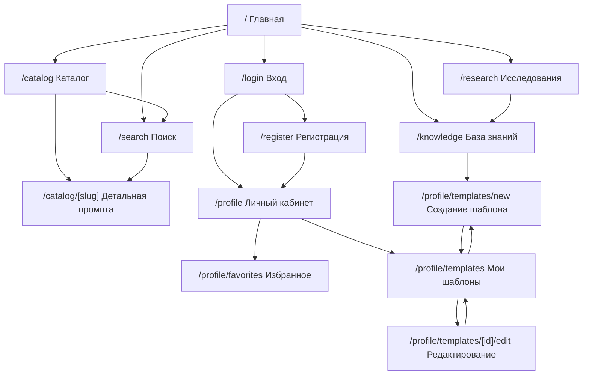

# PromptHub

PromptHub — учебный онлайн-сервис для работы с промптами, шаблонами и материалами по промпт-инжинирингу.

Проект разрабатывается в рамках дисциплины «Разработка интерфейса пользователя».

## Функции сервиса

- редактор промптов;
- база знаний по форматированию промптов;
- база исследований;
- готовые шаблоны по форматированию промптов;
- личный кабинет;
- создание своих шаблонов;
- возможность делиться шаблонами публично;
- публичный каталог промптов с поиском и фильтрацией;
- добавление промптов в избранное.

## Технологический стек

- Next.js;
- React;
- TypeScript;
- CSS Modules;
- App Router.

## Запуск проекта

```bash
pnpm install
pnpm dev
```

Проект будет доступен по адресу:

```txt
http://localhost:3000
```

## Информационная архитектура проекта

### / — Главная страница

Цель страницы: объяснить назначение сервиса и направить пользователя к основным сценариям.

Основной контент:

- описание сервиса;
- переход в каталог промптов;
- переход к созданию шаблона;
- карточки ключевых возможностей.

Точки входа:

- прямая ссылка;
- логотип в header.

Точки выхода:

- каталог промптов;
- создание шаблона;
- база знаний;
- личный кабинет.

### /catalog — Каталог промптов

Цель страницы: дать пользователю возможность найти готовый шаблон промпта.

Основной контент:

- карточки промптов;
- категории;
- фильтры;
- поисковая строка;
- кнопка добавления в избранное.

Точки входа:

- главная страница;
- header;
- страница поиска;
- детальная страница промпта.

Точки выхода:

- детальная страница промпта;
- поиск;
- создание собственного шаблона;
- избранное.

### /catalog/[slug] — Детальная страница промпта

Цель страницы: показать пользователю полный текст промпта и дать возможность скопировать или сохранить его.

Основной контент:

- название промпта;
- описание;
- текст промпта;
- переменные;
- категория;
- кнопка копирования;
- кнопка добавления в избранное.

Точки входа:

- каталог промптов;
- страница поиска;
- избранное;
- публичная ссылка.

Точки выхода:

- каталог;
- избранное;
- создание собственного шаблона.

### /search — Поиск

Цель страницы: показать результаты поиска по промптам и материалам.

Основной контент:

- поле поиска;
- поисковые подсказки;
- фильтры;
- результаты поиска;
- состояния загрузки, ошибки и пустой выдачи.

Точки входа:

- header;
- каталог;
- главная страница;
- URL с query-параметрами.

Точки выхода:

- детальная страница промпта;
- каталог;
- база знаний.

### /knowledge — База знаний

Цель страницы: помочь пользователю изучить правила форматирования и структуру промптов.

Основной контент:

- статьи;
- примеры форматирования;
- правила структуры промпта;
- рекомендации по переменным;
- ссылки на шаблоны.

Точки входа:

- header;
- главная страница;
- страница создания шаблона;
- детальная страница промпта.

Точки выхода:

- создание шаблона;
- каталог;
- база исследований.

### /research — База исследований

Цель страницы: собрать исследования и практические материалы о работе с языковыми моделями.

Основной контент:

- список исследований;
- краткие выводы;
- теги;
- ссылки на связанные шаблоны;
- дата публикации.

Точки входа:

- header;
- главная страница;
- база знаний.

Точки выхода:

- база знаний;
- каталог;
- детальная страница промпта.

### /login — Вход

Цель страницы: дать пользователю возможность войти в личный кабинет.

Основной контент:

- форма входа;
- поле email;
- поле пароля;
- сообщения об ошибках;
- ссылка на регистрацию.

Точки входа:

- header;
- страница регистрации;
- попытка добавить промпт в избранное;
- попытка создать шаблон.

Точки выхода:

- личный кабинет;
- регистрация;
- главная страница.

### /register — Регистрация

Цель страницы: дать пользователю возможность создать аккаунт.

Основной контент:

- форма регистрации;
- поле имени;
- поле email;
- поле пароля;
- подтверждение пароля;
- ссылка на вход.

Точки входа:

- страница входа;
- header;
- главная страница.

Точки выхода:

- личный кабинет;
- вход;
- главная страница.

### /profile — Личный кабинет

Цель страницы: показать пользователю общее состояние аккаунта и быстрые действия.

Основной контент:

- краткая статистика;
- последние созданные шаблоны;
- избранные промпты;
- быстрый переход к созданию шаблона.

Точки входа:

- header;
- вход;
- регистрация;
- после добавления промпта в избранное.

Точки выхода:

- избранное;
- мои шаблоны;
- создание шаблона;
- каталог.

### /profile/favorites — Избранное

Цель страницы: показать сохранённые пользователем промпты.

Основной контент:

- список избранных промптов;
- быстрый переход на детальную страницу;
- удаление из избранного;
- переход в каталог.

Точки входа:

- личный кабинет;
- детальная страница промпта;
- каталог после добавления в избранное.

Точки выхода:

- каталог;
- детальная страница промпта;
- мои шаблоны.

### /profile/templates — Мои шаблоны

Цель страницы: дать пользователю возможность управлять созданными шаблонами.

Основной контент:

- список пользовательских шаблонов;
- статус публичности;
- дата изменения;
- переход к редактированию;
- создание нового шаблона.

Точки входа:

- личный кабинет;
- sidebar личного кабинета;
- после создания шаблона;
- после редактирования шаблона.

Точки выхода:

- создание шаблона;
- редактирование шаблона;
- каталог.

### /profile/templates/new — Создание шаблона

Цель страницы: дать пользователю возможность создать новый шаблон промпта.

Основной контент:

- форма создания шаблона;
- название;
- описание;
- категория;
- редактор промпта;
- переключатель публичности.

Точки входа:

- header;
- личный кабинет;
- мои шаблоны;
- база знаний.

Точки выхода:

- мои шаблоны;
- база знаний;
- каталог.

### /profile/templates/[id]/edit — Редактирование шаблона

Цель страницы: дать пользователю возможность изменить ранее созданный шаблон.

Основной контент:

- форма редактирования;
- текущие данные шаблона;
- редактор промпта;
- предпросмотр;
- сохранение изменений.

Точки входа:

- мои шаблоны;
- после создания шаблона;
- личный кабинет.

Точки выхода:

- мои шаблоны;
- каталог;
- детальная страница шаблона.

## Карта навигации



## Компонентная структура навигации

### Header

Статическая навигация, одинаковая на всех страницах.

Содержит:

- логотип;
- ссылку на каталог;
- ссылку на базу знаний;
- ссылку на исследования;
- ссылку на поиск;
- ссылку на вход;
- кнопку создания шаблона.

### Footer

Статическая навигация, одинаковая на всех страницах.

Содержит:

- название сервиса;
- краткое описание;
- ссылки на основные разделы.

### Breadcrumbs

Контекстная навигация.

Динамически строится на основе текущего маршрута:

- `/catalog` → Главная / Каталог;
- `/profile/templates/new` → Главная / Личный кабинет / Мои шаблоны / Создание шаблона.

### ProfileSidebar

Контекстная навигация внутри личного кабинета.

Содержит:

- обзор;
- избранное;
- мои шаблоны;
- создание шаблона.

## UX-сценарии

### Сценарий 1. Новый пользователь ищет промпт и добавляет его в избранное

1. Пользователь открывает главную страницу.
2. Переходит в каталог промптов.
3. Использует поиск или фильтры.
4. Открывает детальную страницу промпта.
5. Изучает описание и текст промпта.
6. Добавляет промпт в избранное.
7. Переходит в личный кабинет.
8. Видит сохранённый промпт в разделе «Избранное».

Проверка мёртвых концов:

- с детальной страницы можно вернуться в каталог;
- из избранного можно перейти обратно в каталог;
- из каталога можно перейти к созданию своего шаблона.

### Сценарий 2. Пользователь создаёт собственный шаблон

1. Пользователь входит в аккаунт.
2. Переходит в личный кабинет.
3. Открывает раздел «Мои шаблоны».
4. Нажимает «Создать шаблон».
5. Заполняет форму.
6. Использует редактор промптов.
7. Сохраняет шаблон.
8. Возвращается к списку своих шаблонов.

Проверка мёртвых концов:

- со страницы создания можно перейти к базе знаний;
- после создания пользователь возвращается к списку шаблонов;
- из списка шаблонов можно перейти к редактированию.

## Улучшения навигации для предотвращения мёртвых концов

- На каждой странице есть header с основными разделами.
- В личном кабинете есть sidebar с локальной навигацией.
- Breadcrumbs показывают текущий путь пользователя.
- На страницах есть явные действия для перехода дальше.
- Личный кабинет закрыт от индексации через robots.txt.
- Публичные страницы добавлены в sitemap.xml.

## Соответствие домашнему заданию 1

| Критерий | Где выполнено |
|---|---|
| Описано дерево страниц | README, раздел «Информационная архитектура проекта» |
| Для каждой страницы указана цель | README, описание каждой страницы |
| Указаны основные типы контента | README, описание каждой страницы |
| Указаны точки входа и выхода | README, описание каждой страницы |
| Описана компонентная структура навигации | README, раздел «Компонентная структура навигации» |
| Указана статическая и контекстная навигация | README, Header/Footer/Breadcrumbs/ProfileSidebar |
| Описаны пользовательские сценарии | README, раздел «UX-сценарии» |
| Нет мёртвых концов | README, раздел «Улучшения навигации» |
| Добавлена Mermaid-диаграмма | README, раздел «Карта навигации» |
| Добавлен sitemap.xml | src/app/sitemap.ts |
| Добавлен robots.txt | src/app/robots.ts |

## Домашнее задание 2. Формы, валидация и поиск

На втором этапе в проект добавлены рабочие формы, клиентская валидация и GET-поиск по шаблонам промптов.

### Что реализовано

- форма входа `/login`;
- форма регистрации `/register`;
- форма создания шаблона `/profile/templates/new`;
- форма редактирования шаблона `/profile/templates/[id]/edit`;
- клиентская валидация через React Hook Form и Zod;
- блокировка кнопки отправки при невалидных данных;
- понятные сообщения об ошибках рядом с полями;
- сохранение созданных шаблонов в `localStorage`;
- страница поиска `/search`;
- GET-параметры поиска в URL;
- восстановление поля поиска, категории и результатов после перезагрузки страницы;
- поисковые подсказки с debounce;
- минимальная длина поискового запроса — 3 символа;
- состояния загрузки, ошибки и пустой выдачи;
- отмена запросов через `AbortController` при изменении запроса или размонтировании компонента;
- mock API-роуты `/api/search` и `/api/prompts`.

### Основные файлы второго этапа

| Часть | Файлы |
|---|---|
| Mock-данные | `src/shared/mock/prompts.ts`, `src/shared/types/prompt.ts` |
| Debounce | `src/shared/lib/debounce/useDebouncedValue.ts` |
| Формы входа и регистрации | `src/features/auth-form` |
| Форма шаблона | `src/features/template-form` |
| Поиск | `src/features/prompt-search` |
| Каталог | `src/features/prompt-catalog` |
| Карточка и детальная страница промпта | `src/entities/prompt/ui` |
| Список моих шаблонов | `src/features/my-templates` |
| API поиска | `src/app/api/search/route.ts` |
| API промптов | `src/app/api/prompts/route.ts` |

### Проверка формы входа

Страница: `/login`

Проверяется:

- email обязателен и должен быть корректным;
- пароль обязателен и должен быть не короче 6 символов;
- кнопка отправки заблокирована, пока данные невалидны;
- после успешной отправки данные пользователя сохраняются в `localStorage`.

### Проверка формы регистрации

Страница: `/register`

Проверяется:

- имя обязательно и должно быть не короче 2 символов;
- email обязателен и должен быть корректным;
- пароль должен быть не короче 6 символов;
- подтверждение пароля должно совпадать с паролем;
- кнопка отправки заблокирована, пока данные невалидны.

### Проверка формы создания шаблона

Страница: `/profile/templates/new`

Проверяется:

- название обязательно, минимум 3 символа;
- описание обязательно, минимум 10 символов;
- категория обязательна;
- текст промпта обязателен, минимум 20 символов;
- есть поле переменных;
- есть переключатель публичности;
- есть быстрые кнопки редактора для вставки заголовка, переменной, XML-тега, стрелки и декоратора;
- данные сохраняются в `localStorage` и отображаются на странице `/profile/templates`.

### Проверка GET-поиска

Страница: `/search`

Примеры URL:

```txt
/search?q=frontend
/search?q=контент&category=marketing
/search?category=development
```

Проверяется:

- поиск использует GET-параметры `q` и `category`;
- запрос отправляется только после ввода минимум 3 символов;
- подсказки появляются с задержкой;
- результаты восстанавливаются после перезагрузки страницы;
- при запросе `network-error` API возвращает ошибку, чтобы можно было проверить error state;
- при отсутствии результатов отображается empty state;
- при выполнении запроса отображается loading state;
- запросы отменяются через `AbortController`.

### Чек-лист самопроверки ДЗ 2

| Критерий | Статус | Где смотреть |
|---|---|---|
| Все формы покрыты валидацией | Выполнено | `/login`, `/register`, `/profile/templates/new`, `/profile/templates/[id]/edit` |
| Есть понятные сообщения об ошибках | Выполнено | компоненты `LoginForm`, `RegisterForm`, `TemplateForm` |
| Кнопка отправки блокируется при невалидных данных | Выполнено | `isValid` из React Hook Form |
| Поиск выполняется GET-запросом | Выполнено | `/search`, `/api/search` |
| Подсказки приходят с debounce | Выполнено | `PromptSearchPage`, `useDebouncedValue` |
| Запрос отправляется минимум после 3 символов | Выполнено | `MIN_QUERY_LENGTH = 3` |
| Параметры поиска сохраняются в URL | Выполнено | `q` и `category` в адресной строке |
| После перезагрузки поиск восстанавливается | Выполнено | состояние берётся из `useSearchParams` |
| Есть loading/error/empty states | Выполнено | `PromptSearchPage` |
| Запросы отменяются при размонтировании | Выполнено | `AbortController` в `PromptSearchPage` |
